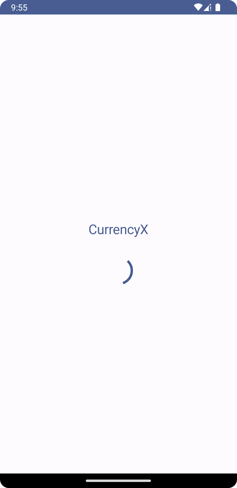
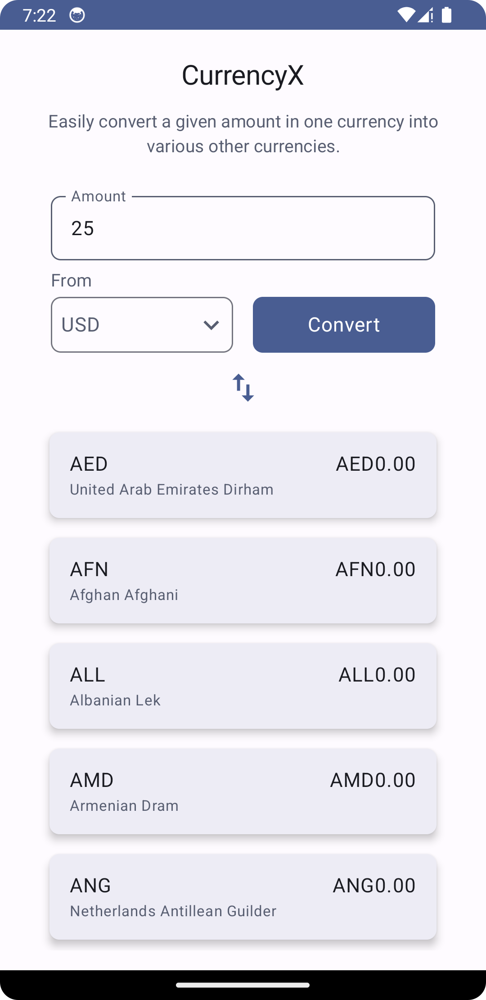
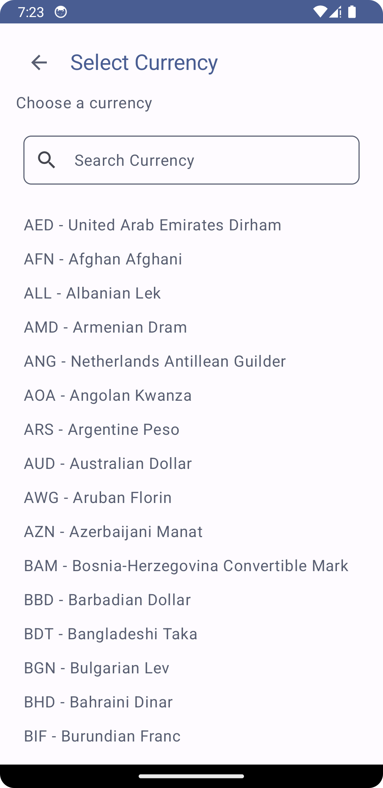

# CurrencyX - A Currency Conversion App

CurrencyX is a mobile app developed to meet the challenge of building a currency conversion application. With CurrencyX, users can effortlessly convert any given amount in a selected currency into multiple other currencies. The app fetches exchange rate data from the Open Exchange Rates service, and this data is stored locally to allow offline usage.

## Features

- **Currency Selection**: Users can choose their base currency from a list of options provided by Open Exchange Rates.

- **Amount Input**: Users can enter the desired amount they wish to convert in the selected currency.

- **Currency Conversion**: CurrencyX provides a list of converted amounts in various other currencies, based on the user's input and the latest exchange rates. If exchange rates for the selected currency are not available via Open Exchange Rates, the app performs the conversions on the client side.

- **Offline Usage**: To minimize bandwidth usage, the app refreshes exchange rate data from the API no more frequently than once every 30 minutes.

- **Unit Tests**: The project includes unit tests to ensure the correct operation of the app.

## Technologies Used

- **Platform**: Android (Kotlin with Gradle)

## How to Run

1. Clone this repository.
2. Open the project in Android Studio.
3. Build and run the app on an Android emulator or device.

## Unit Tests

The project contains a suite of unit tests that can be executed to ensure the app's functionality and reliability. To run these tests:

1. Open the project in Android Studio.
2. Navigate to the test classes in the project directory.
3. Right-click on the test class you want to run and select "Run."

## Open Exchange Rates API

CurrencyX uses the Open Exchange Rates service to fetch exchange rate data. To use this API, you need to obtain a free App ID from the Open Exchange Rates website.

[Open Exchange Rates - Get a Free App ID](https://openexchangerates.org/signup)

Screenshots
------------------------------------------

    
    
    
    

